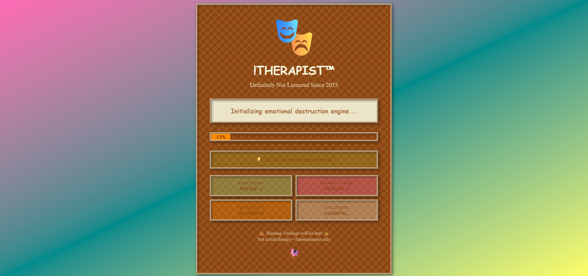

# !THERAPIST™ 🎭

## Basic Details

### Name: Aakamsh P M

### Project Description

!THERAPIST™ is a satirical AI-powered "therapy" chat app that delivers brutal honesty, sarcasm, and emotional damage instead of actual help. It’s an interactive web experience where users chat with a fake AI therapist that roasts them, triggers fake paywalls, and assigns pointless therapy tasks—purely for entertainment!

### The Problem (that doesn't exist)

People have too much self-esteem and not enough exposure to 90s website nostalgia. The world is lacking a platform where getting roasted by an AI is the goal, not the side effect.

### The Solution (that nobody asked for)

An intentionally ugly, retro-styled web app where users can confess their life problems only to receive savage burns, fake paywall popups, and "therapy" tasks that are either impossible or just deeply embarrassing. All powered by Gemini AI and 100% guaranteed to hurt your feelings (not heal them).

---

## Technical Details

### Technologies/Components Used

**For Software:**

- **Languages:** TypeScript, JavaScript, CSS
- **Frameworks:** React, Vite
- **Libraries:** Tailwind CSS, Google Gemini API
- **Tools:** localStorage, Custom UI components, SVG backgrounds, Fake Paywall Engine™

**For Hardware:**

- Runs on any device with a web browser and enough courage.

---

### Implementation

**For Software:**

#### Installation

```bash
git clone https://github.com/aakamshpm/therapist-roast-app.git
cd therapist-roast-app
npm install
```

#### Run

```bash
npm run dev
```

**Note:** You’ll need a Google Gemini API key. Set it up in your `.env` as `VITE_GEMINI_API_KEY=YOUR_KEY_HERE`.

---

### Project Documentation

#### Screenshots


_Landing page: Behold the glorious 90s UI and the start of your emotional destruction._


_AI therapist delivering a signature roast and follow-up question after your confession._


_The infamous fake paywall—choose to pay (with imaginary money) or confess your deepest shame!_

#### Diagrams

_Workflow: User sends message → AI roasts you → Fake paywall/trivial therapy task → Repeat until ego is destroyed._

---

**For Hardware:**  
N/A (unless you count your broken spirit)

---

### Project Demo

- [Live site](https://therapist-virid-zeta.vercel.app/)

---

## Team Contributions

- **Aakamsh P M:**
  - Concept & design
  - All code: frontend, fake backend, paywall logic
  - Gemini prompt engineering
  - UI/UX (intentionally ugly)
  - Testing (emotional stability not guaranteed)

---

Made with ❤️ and zero empathy at TinkerHub Useless Projects


